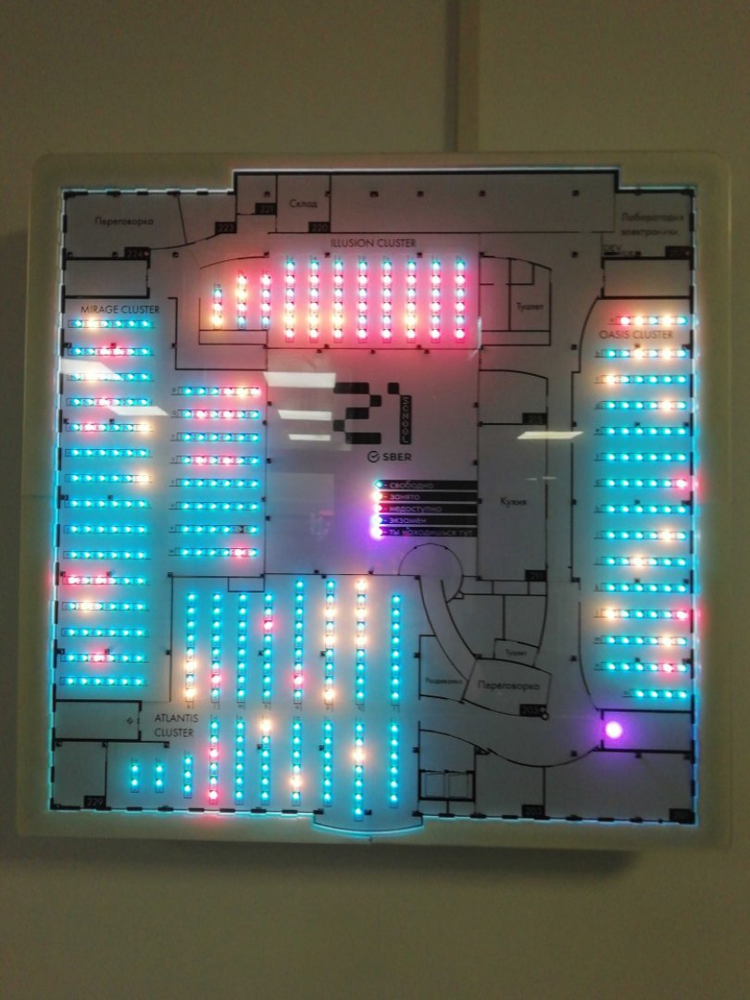
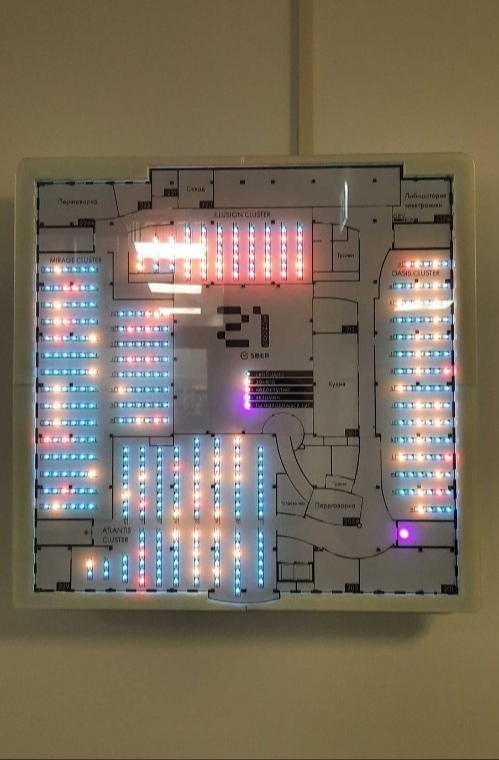

# 21School-Cluster-Activity-Monitor
In order to visualize clusters computers accesibility for students and make finding a coding place for oneself easier, School 21's Lab Manager Freimor (Ricky in School 21) came up with the idea of autonomous Cluster Activity Monitor.
It should be set up on each of the School's floors. We've managed to set it up on the 2nd floor.
Monitor has a map embedded in its graphics. It lights up LEDs, showing which Mac seats are occupied, which are free to use and other types of seat status. It's connected to a local network and pulls data from the metrics data-point server. 
* Monitor shows seats that are either taken, free, covid-free or used for exam.
* It also lights up the viewer's position on the map.
* Brightness of the LED is dependant on ambient light level, due to embedded light sensor.
* It should potentially support extra add-ons.

Done by team: Ricky, Bomanyte.

